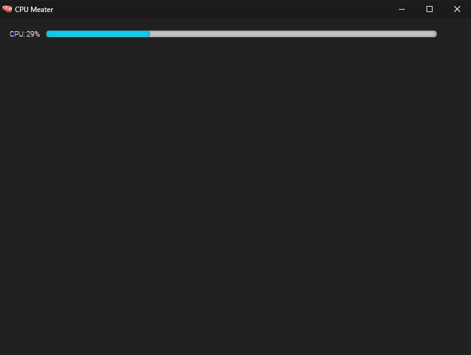

# CPU Meater

Watch the [YouTube guide](#) or download the source code and tinker with it yourself!

## Screenshot



## Installation

```py
python -m venv env
pip install -r requirements.txt
```

## Run

start `app.py`

## Compile Executable

run `build.bat` on Windows
run `source build.sh` on Linux


## Credits

App icon made by DinosoftLabs from www.flaticon.com

## Other

To get the code identical to the YouTube guide, do this:

```git
git checkout eba01de4f53ddadd0bcc9d0d177eda00ae1e0b17
```

## Contribution

Enhancements, Forks and Contributions of any kind are welcome!